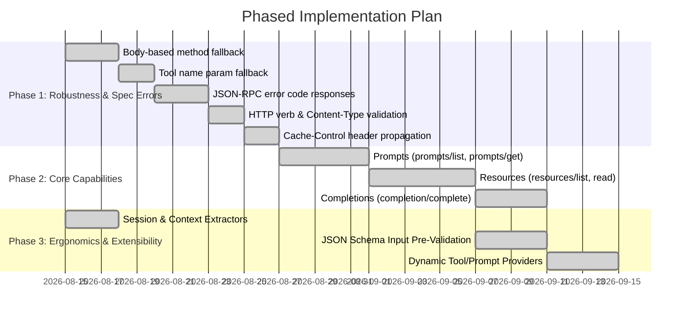

# Model Context Protocol (MCP) Roadmap

This roadmap tracks all Model Context Protocol (MCP) features and capabilities for the **stateless HTTP transport** ([`2026-07-28` specification](https://modelcontextprotocol.io/docs/2026-07-28/)) implemented via [Tower](https://crates.io/crates/tower).

---

## Status Legend

| Symbol | Status | Description |
|:---:|:---|:---|
| ✅ | **Implemented** | Fully implemented and covered by unit/integration tests |
| 🟡 | **Partial** | Types or definitions exist, but runtime routing, validation, or handlers are missing |
| ❌ | **Not Implemented** | Feature is currently missing from the library |

---

## 1. HTTP Transport & Tower Routing

| Feature | Status | Details | Primary References |
|---|:---:|---|---|
| **Tower `Service` Implementation** | ✅ | [`McpRouter`](src/router.rs) implements `tower::Service<Request<B>>` for any body `B: http_body::Body<Data = Bytes>` | [`src/router.rs`](src/router.rs) |
| **Streaming `ResponseBody`** | ✅ | Custom box-body [`ResponseBody`](src/body.rs) supporting `Bytes`, `Vec<u8>`, `String`, and conversions | [`src/body.rs`](src/body.rs) |
| **Header-Based Method Routing** | ✅ | Dispatches via `Mcp-Method` header (`server/discover`, `tools/list`, `tools/call`) | [`src/router.rs`](src/router.rs) |
| **Header-Based Tool Target Routing** | ✅ | Routes tool calls via `Mcp-Name: <name>` header | [`src/router.rs`](src/router.rs) |
| **Body-Based Method Dispatch Fallback** | ✅ | Fall back to `request.method` inside JSON-RPC body when `Mcp-Method` header is omitted | [`src/router.rs`](src/router.rs) |
| **Body-Based Tool Name Fallback** | ✅ | Fall back to `params.name` in [`CallToolParams`](src/types/mcp/tools/call.rs) when `Mcp-Name` header is omitted | [`src/router.rs`](src/router.rs) |
| **HTTP Verb & Media Type Negotiation** | ✅ | Validate `POST` method (return `405 Method Not Allowed` with `Allow: POST`) and `Content-Type: application/json` (return `415 Unsupported Media Type`) | [`src/router.rs`](src/router.rs) |
| **HTTP Caching Headers Propagation** | ✅ | Set HTTP `Cache-Control` (`public`/`private`, `max-age`) and `ETag` headers matching `ttl_ms` and `cache_scope` | [`src/body.rs`](src/body.rs), [`src/router.rs`](src/router.rs) |
| **`Mcp-Session-Id` Header Handling** | ✅ | Extract, validate, and propagate `Mcp-Session-Id` correlation header to handlers and outgoing responses | [`src/router.rs`](src/router.rs), [`src/extract.rs`](src/extract.rs) |
| **Per-Request `_meta` Propagation** | ✅ | Extract and pass [`RequestMetaObject`](src/types/mcp/mod.rs) (`clientInfo`, `protocolVersion`, `progressToken`) via [`Meta`](src/extract.rs) and [`RequestContext`](src/extract.rs) | [`src/extract.rs`](src/extract.rs), [`src/tools/mod.rs`](src/tools/mod.rs), [`src/prompts/mod.rs`](src/prompts/mod.rs) |
| **Session & Context Extractors** | ✅ | Support [`SessionId`](src/extract.rs), [`Authorization`](src/extract.rs), [`BearerAuth`](src/extract.rs), [`RequestContext`](src/extract.rs), [`Meta`](src/extract.rs), and Tower extractors ([`State<T>`](src/extract.rs), [`Extension<T>`](src/extract.rs), [`HeaderMap`](https://docs.rs/http/latest/http/header/struct.HeaderMap.html)) in handler signatures | [`src/extract.rs`](src/extract.rs), [`src/tools/mod.rs`](src/tools/mod.rs), [`src/prompts/mod.rs`](src/prompts/mod.rs) |

---

## 2. JSON-RPC 2.0 Protocol Compliance

| Feature | Status | Details | Primary References |
|---|:---:|---|---|
| **JSON-RPC Request Model** | ✅ | [`JsonRpcRequest
`](src/types/jsonrpc/request.rs) with flexible generic parameters | [`src/types/jsonrpc/request.rs`](src/types/jsonrpc/request.rs) |
| **Flexible Request ID Format** | ✅ | [`JsonRpcRequestId`](src/types/jsonrpc/mod.rs) supporting string and numeric IDs | [`src/types/jsonrpc/mod.rs`](src/types/jsonrpc/mod.rs) |
| **JSON-RPC Success Responses** | ✅ | [`JsonRpcResultResponse<R>`](src/types/jsonrpc/response.rs) serialized with standard `jsonrpc: "2.0"` | [`src/types/jsonrpc/response.rs`](src/types/jsonrpc/response.rs) |
| **JSON-RPC Error Structures** | ✅ | [`JsonRpcErrorResponse<E>`](src/types/jsonrpc/response.rs) with standard `error` objects and `id` mapping (including `null` on parse errors) | [`src/types/jsonrpc/response.rs`](src/types/jsonrpc/response.rs) |
| **Standard JSON-RPC Error Codes** | ✅ | Structured error mapping for `ParseError` (`-32700`), `InvalidRequest` (`-32600`), `MethodNotFound` (`-32601`), `InvalidParams` (`-32602`), and `InternalError` (`-32603`) | [`src/types/jsonrpc/error.rs`](src/types/jsonrpc/error.rs) |
| **JSON-RPC Batch Requests** | ✅ | Concurrent processing and batching array payloads `[JsonRpcRequest, ...]` over HTTP POST with JSON-RPC 2.0 compliance | [`src/router.rs`](src/router.rs), [`src/types/jsonrpc/batch.rs`](src/types/jsonrpc/batch.rs) |
| **JSON-RPC Notifications** | ✅ | Handling single and batch notifications without response generation, returning HTTP 204 No Content | [`src/types/jsonrpc/notification.rs`](src/types/jsonrpc/notification.rs), [`src/router.rs`](src/router.rs) |

---

## 3. Server Discovery & Metadata (`server/*`)

| Feature | Status | Details | Primary References |
|---|:---:|---|---|
| **`server/discover` Endpoint** | ✅ | Built-in endpoint via [`handle_server_discover`](src/server/discover.rs) | [`src/server/discover.rs`](src/server/discover.rs) |
| **Server Implementation Info** | ✅ | [`Implementation`](src/types/mcp/mod.rs) metadata (`name`, `version`, `title`, `description`, `website_url`, `icons`) | [`src/types/mcp/mod.rs`](src/types/mcp/mod.rs) |
| **Server Capabilities Advertisement** | ✅ | [`ServerCapabilities`](src/types/mcp/mod.rs) advertising tools, resources, prompts, completions, and experimental | [`src/types/mcp/mod.rs`](src/types/mcp/mod.rs) |
| **Human-Readable Instructions** | ✅ | Router builder method [`.instructions()`](src/router.rs) serialized into discovery response | [`src/router.rs`](src/router.rs) |
| **Supported Versions Configuration** | ✅ | Configurable supported protocol versions (defaults to `["2026-07-28"]`) | [`src/router.rs`](src/router.rs) |
| **Protocol Version Negotiation** | ✅ | Validate client `protocolVersion` in [`RequestMetaObject`](src/types/mcp/mod.rs) against server `supported_versions` with configurable enforcement via [`.validate_protocol_version()`](src/router/builder.rs) | [`src/server/discover.rs`](src/server/discover.rs), [`src/server/config.rs`](src/server/config.rs), [`src/router/builder.rs`](src/router/builder.rs) |
| **First-Class Discovery Handler** | ✅ | Unified handler via [`.discover()`](src/router/builder.rs) supporting typed extractors ([`RequestContext`](src/extract.rs), [`SessionId`](src/extract.rs), [`BearerAuth`](src/extract.rs), [`Meta`](src/extract.rs), [`Extension`](src/extract.rs), [`State`](src/extract.rs)) and flexible return conversions | [`src/server/provider.rs`](src/server/provider.rs), [`src/server/config.rs`](src/server/config.rs), [`src/router/builder.rs`](src/router/builder.rs) |

---

## 4. Tools Capability (`tools/*`)

| Feature | Status | Details | Primary References |
|---|:---:|---|---|
| **Tools Capability Flag** | ✅ | [`ToolsCapability`](src/types/mcp/mod.rs) advertising `list_changed` support | [`src/types/mcp/mod.rs`](src/types/mcp/mod.rs) |
| **Tool Definitions & Models** | ✅ | [`Tool`](src/types/mcp/mod.rs) with schema, icons, titles, and [`ToolAnnotations`](src/types/mcp/mod.rs) (`read_only_hint`, `destructive_hint`, `idempotent_hint`, `open_world_hint`) | [`src/types/mcp/mod.rs`](src/types/mcp/mod.rs) |
| **`tools/list` Endpoint** | ✅ | Built-in list handler in [`handle_list_tools`](src/tools/list.rs) and custom handler support via [`.tools_list()`](src/router/builder.rs) with caching and pagination | [`src/tools/list.rs`](src/tools/list.rs), [`src/tools/registry.rs`](src/tools/registry.rs) |
| **`tools/call` Endpoint** | ✅ | Dispatches tool invocation to registered handlers in [`router.rs`](src/router.rs) | [`src/router.rs`](src/router.rs) |
| **Typed Asynchronous Handlers** | ✅ | [`IntoToolHandler`](src/tools/mod.rs) for `async fn()` and `async fn(Args)` with Serde JSON deserialization | [`src/tools/mod.rs`](src/tools/mod.rs) |
| **Flexible Result Conversions** | ✅ | [`IntoToolResult`](src/tools/mod.rs) for `String`, `&str`, `ContentBlock`, `Vec<ContentBlock>`, `CallToolResult`, and `Result<T, E>` | [`src/tools/mod.rs`](src/tools/mod.rs) |
| **Tool Pagination (`cursor`)** | ✅ | Full pagination support via [`ListToolsParams`](src/types/mcp/tools/list.rs) and custom [`.tools_list()`](src/router/builder.rs) handlers returning [`ListToolsResult::with_next_cursor()`](src/types/mcp/tools/list.rs) | [`src/types/mcp/tools/list.rs`](src/types/mcp/tools/list.rs), [`src/tools/list.rs`](src/tools/list.rs) |
| **Input JSON Schema Pre-Validation** | ✅ | Pre-compiled JSON Schema validation of raw arguments against `tool.input_schema` prior to deserialization | [`src/tools/registry.rs`](src/tools/registry.rs) |
| **Structured Output Helpers** | ✅ | [`CallToolResult`](src/types/mcp/tools/call.rs) structured content constructors and fluent builders, [`Json<T>`](src/extract/json.rs) wrapper, generic [`CallToolResult<T>`](src/types/mcp/tools/call.rs) result conversions, and tuple returns | [`src/types/mcp/tools/call.rs`](src/types/mcp/tools/call.rs), [`src/extract/json.rs`](src/extract/json.rs), [`src/tools/mod.rs`](src/tools/mod.rs) |
| **First-Class Tools List Handler** | ✅ | Register custom async provider for listing tools generated or filtered per-request via [`.tools_list()`](src/router/builder.rs) / [`.list_tools()`](src/router/builder.rs) | [`src/tools/list.rs`](src/tools/list.rs), [`src/tools/registry.rs`](src/tools/registry.rs), [`src/router/builder.rs`](src/router/builder.rs) |

---

## 5. Multi-Modal Content & Data Types

| Feature | Status | Details | Primary References |
|---|:---:|---|---|
| **Text Content** | ✅ | [`TextContent`](src/types/mcp/mod.rs) with annotations and metadata | [`src/types/mcp/mod.rs`](src/types/mcp/mod.rs) |
| **Image Content** | ✅ | [`ImageContent`](src/types/mcp/mod.rs) with base64 data and mimeType | [`src/types/mcp/mod.rs`](src/types/mcp/mod.rs) |
| **Audio Content** | ✅ | [`AudioContent`](src/types/mcp/mod.rs) with base64 data and mimeType | [`src/types/mcp/mod.rs`](src/types/mcp/mod.rs) |
| **Embedded Resources** | ✅ | [`EmbeddedResource`](src/types/mcp/mod.rs) (`TextResourceContents` and `BlobResourceContents`) | [`src/types/mcp/mod.rs`](src/types/mcp/mod.rs) |
| **Resource Links** | ✅ | [`ResourceLink`](src/types/mcp/mod.rs) referencing external or hosted resources | [`src/types/mcp/mod.rs`](src/types/mcp/mod.rs) |
| **Content Annotations** | ✅ | [`ContentAnnotations`](src/types/mcp/mod.rs) with `audience` ([`Role`](src/types/mcp/mod.rs)) and `priority` (0.0–1.0) | [`src/types/mcp/mod.rs`](src/types/mcp/mod.rs) |
| **UI Icon Specifications** | ✅ | [`Icon`](src/types/mcp/mod.rs) with `src`, `mime_type`, `sizes`, and [`IconTheme`](src/types/mcp/mod.rs) | [`src/types/mcp/mod.rs`](src/types/mcp/mod.rs) |
| **Progress Tokens & Caching Scopes** | ✅ | [`ProgressToken`](src/types/mcp/mod.rs) and [`CacheScope`](src/types/mcp/mod.rs) | [`src/types/mcp/mod.rs`](src/types/mcp/mod.rs) |

---

## 6. Resources Capability (`resources/*`)

| Feature | Status | Details | Primary References |
|---|:---:|---|---|
| **Resource Capability Flag** | ✅ | [`ResourcesCapability`](src/types/mcp/mod.rs) advertised automatically upon registering resources or templates | [`src/types/mcp/mod.rs`](src/types/mcp/mod.rs), [`src/router/builder.rs`](src/router/builder.rs) |
| **Resource Definitions & Models** | ✅ | [`Resource`](src/types/mcp/resources/mod.rs), [`ResourceTemplate`](src/types/mcp/resources/mod.rs), [`ResourceAnnotations`](src/types/mcp/resources/mod.rs) data types and fluent builders | [`src/types/mcp/resources/mod.rs`](src/types/mcp/resources/mod.rs) |
| **`resources/list` Endpoint** | ✅ | Listing available direct resources with built-in handler and custom [`.resources_list()`](src/router/builder.rs) handler with pagination & caching | [`src/resources/list.rs`](src/resources/list.rs), [`src/resources/registry.rs`](src/resources/registry.rs) |
| **`resources/read` Endpoint** | ✅ | Reading text/blob resource content by direct URI or matching RFC 6570 URI templates | [`src/resources/read.rs`](src/resources/read.rs), [`src/resources/registry.rs`](src/resources/registry.rs) |
| **`resources/templates/list` Endpoint**| ✅ | Listing URI templates with built-in handler and custom [`.resource_templates_list()`](src/router/builder.rs) handler with caching | [`src/resources/templates.rs`](src/resources/templates.rs), [`src/resources/registry.rs`](src/resources/registry.rs) |
| **Typed Resource Handlers** | ✅ | [`IntoResourceHandler`](src/resources/mod.rs) and [`IntoResourceResult`](src/resources/mod.rs) for `async fn()` and `async fn(extractors..., uri: String)` | [`src/resources/mod.rs`](src/resources/mod.rs), [`src/router/builder.rs`](src/router/builder.rs) |

---

## 7. Prompts Capability (`prompts/*`)

| Feature | Status | Details | Primary References |
|---|:---:|---|---|
| **Prompt Capability Flag** | ✅ | [`PromptsCapability`](src/types/mcp/mod.rs) advertised automatically upon registering prompts | [`src/types/mcp/mod.rs`](src/types/mcp/mod.rs), [`src/router.rs`](src/router.rs) |
| **Prompt Definitions & Models** | ✅ | [`Prompt`](src/types/mcp/prompts/mod.rs), [`PromptArgument`](src/types/mcp/prompts/mod.rs), [`PromptMessage`](src/types/mcp/prompts/mod.rs) data types and builders | [`src/types/mcp/prompts/mod.rs`](src/types/mcp/prompts/mod.rs) |
| **`prompts/list` Endpoint** | ✅ | Built-in handler in [`handle_list_prompts`](src/prompts/list.rs) and custom handler support via [`.prompts_list()`](src/router/builder.rs) with caching | [`src/prompts/list.rs`](src/prompts/list.rs), [`src/prompts/registry.rs`](src/prompts/registry.rs) |
| **`prompts/get` Endpoint** | ✅ | Retrieving prompt messages with argument substitution, multi-modal content, and caching | [`src/prompts/mod.rs`](src/prompts/mod.rs), [`src/router.rs`](src/router.rs) |
| **Typed Prompt Handlers** | ✅ | [`IntoPromptHandler`](src/prompts/mod.rs) and [`IntoPromptResult`](src/prompts/mod.rs) for `async fn()` and `async fn(Args)` | [`src/prompts/mod.rs`](src/prompts/mod.rs) |
| **First-Class Prompts List Handler** | ✅ | Register custom async provider for listing prompts generated or filtered per-request via [`.prompts_list()`](src/router/builder.rs) / [`.list_prompts()`](src/router/builder.rs) | [`src/prompts/list.rs`](src/prompts/list.rs), [`src/prompts/registry.rs`](src/prompts/registry.rs), [`src/router/builder.rs`](src/router/builder.rs) |

---

## 8. Completions Capability (`completion/*`)

| Feature | Status | Details | Primary References |
|---|:---:|---|---|
| **Completions Capability Flag** | ✅ | [`CompletionsCapability`](src/types/mcp/mod.rs) advertised automatically upon registering completion handlers | [`src/types/mcp/mod.rs`](src/types/mcp/mod.rs), [`src/router/builder.rs`](src/router/builder.rs) |
| **`completion/complete` Endpoint** | ✅ | Autocompletion endpoint for prompt arguments and resource reference values with caching and pagination | [`src/completion/mod.rs`](src/completion/mod.rs), [`src/completion/registry.rs`](src/completion/registry.rs) |
| **Completion Types & Handlers** | ✅ | [`CompleteRequest`](src/types/mcp/completion/mod.rs), [`CompleteResult`](src/types/mcp/completion/mod.rs), [`IntoCompletionHandler`](src/completion/mod.rs), and registration APIs ([`.completion()`](src/router/builder.rs), [`.register_prompt_completion()`](src/router/builder.rs), [`.register_resource_completion()`](src/router/builder.rs)) | [`src/types/mcp/completion/mod.rs`](src/types/mcp/completion/mod.rs), [`src/completion/mod.rs`](src/completion/mod.rs), [`src/router/builder.rs`](src/router/builder.rs) |

---

## 9. Logging & Diagnostics (`logging/*`)

| Feature | Status | Details | Primary References |
|---|:---:|---|---|
| **Logging Severity Levels** | ✅ | [`LoggingLevel`](src/types/mcp/mod.rs) enum matching RFC-5424 severities | [`src/types/mcp/mod.rs`](src/types/mcp/mod.rs) |
| **`logging/setLevel` Endpoint** | ❌ | Endpoint allowing clients to dynamically request server logging threshold | Planned for `src/logging/` |
| **Per-Request `logLevel` Handling**| 🟡 | `log_level` parsed in [`RequestMetaObject`](src/types/mcp/mod.rs), but not yet wired to tracing filters | [`src/types/mcp/mod.rs`](src/types/mcp/mod.rs) |

---

## Phased Development Plan

