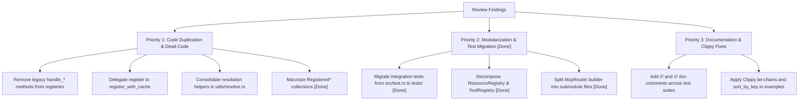

# Code Quality Review: Modularization, Duplication, and Idiomatic Rust

**Project**: `mcp-routing`  
**Date**: August 2026  
**Status**: Review Complete — Actionable Recommendations Provided  

---

## Executive Summary

A comprehensive architectural and code quality review of the `mcp-routing` codebase was conducted, focusing on three core areas:
1. **Modularization & File Size Limits**: Adherence to the project guideline of decomposing complex subsystems into submodules of ~250–300 lines.
2. **Code Duplication**: Identification of redundant handlers, duplicate registration logic, repeated validation workflows, and duplicated integration tests.
3. **Idiomatic Rust & Coding Standards**: Evaluation of Rust 2024 edition patterns, Clippy diagnostics, Serde usage, and compliance with testing and minimal scope standards.

Overall, the codebase is well-architected around Tower services and strict MCP `2026-07-28` specification semantics. However, several high-value refactoring opportunities exist to improve maintainability, reduce boilerplate, eliminate dead code, and ensure strict compliance with project rules.

---

## 1. Modularization & Architecture

### 1.1 Single-File Size Limit Exceedances `[COMPLETED]`
Per `.agents/rules/mcp_development_guidelines.md` (Section 2), complex subsystems should be broken into modular files kept under ~250–300 lines. All 8 large files have been modularized:

| Module / File | Original Lines | Decomposition / Result | Status |
|---|---|---|---|
| [`src/test.rs`](file:///C:/Users/andre/Projects/mcp-routing/tests/router_core.rs) | 1,367 lines | Relocated black-box tests to [`tests/router_core.rs`](file:///C:/Users/andre/Projects/mcp-routing/tests/router_core.rs) (37 tests) and unit tests to [`src/router/builder/tests.rs`](file:///C:/Users/andre/Projects/mcp-routing/src/router/builder/tests.rs). Removed `src/test.rs`. | **Completed** |
| [`src/resources/registry.rs`](file:///C:/Users/andre/Projects/mcp-routing/src/resources/registry/mod.rs) | 770 lines | Decomposed into [`src/resources/registry/`](file:///C:/Users/andre/Projects/mcp-routing/src/resources/registry/) (`mod.rs`, `dispatch.rs`, `template.rs`, `tests.rs`). | **Completed** |
| [`src/router/builder.rs`](file:///C:/Users/andre/Projects/mcp-routing/src/router/builder/mod.rs) | 689 lines | Decomposed into [`src/router/builder/`](file:///C:/Users/andre/Projects/mcp-routing/src/router/builder/) (`mod.rs`, `tools.rs`, `prompts.rs`, `resources.rs`, `completion.rs`, `tests.rs`). | **Completed** |
| [`src/tools/mod.rs`](file:///C:/Users/andre/Projects/mcp-routing/src/tools/mod.rs) | 640 lines | Extracted `ToolHandler`, `IntoToolHandler`, and extractor adapter macros to [`src/tools/handler.rs`](file:///C:/Users/andre/Projects/mcp-routing/src/tools/handler.rs). | **Completed** |
| [`src/tools/registry.rs`](file:///C:/Users/andre/Projects/mcp-routing/src/tools/registry/mod.rs) | 598 lines | Decomposed into [`src/tools/registry/`](file:///C:/Users/andre/Projects/mcp-routing/src/tools/registry/) (`mod.rs`, `dispatch.rs`, `validation.rs`, `tests.rs`). | **Completed** |
| [`src/types/mcp/core/mrtr.rs`](file:///C:/Users/andre/Projects/mcp-routing/src/types/mcp/core/mrtr/mod.rs) | 533 lines | Decomposed into [`src/types/mcp/core/mrtr/`](file:///C:/Users/andre/Projects/mcp-routing/src/types/mcp/core/mrtr/) (`mod.rs`, `types.rs`, `request.rs`, `response.rs`, `tests.rs`). | **Completed** |
| [`src/prompts/registry.rs`](file:///C:/Users/andre/Projects/mcp-routing/src/prompts/registry/mod.rs) | 498 lines | Decomposed into [`src/prompts/registry/`](file:///C:/Users/andre/Projects/mcp-routing/src/prompts/registry/) (`mod.rs`, `dispatch.rs`, `tests.rs`). | **Completed** |
| [`src/extract/registered.rs`](file:///C:/Users/andre/Projects/mcp-routing/src/extract/registered.rs) | 427 lines | Consolidated struct definitions via declarative macro `impl_registered_collection!` down to 150 lines. | **Completed** |

### 1.2 Separation of Unit Tests vs. Integration Tests `[COMPLETED]`
- **Finding**: [`src/test.rs`](file:///C:/Users/andre/Projects/mcp-routing/tests/router_core.rs) previously contained 1,367 lines of black-box oneshot HTTP request tests (`app.oneshot(request)`).
- **Rule Reference**: `.agents/rules/testing_standards.md` explicitly reserves `tests/` for black-box HTTP / Tower integration tests, while `src/` should only house isolated unit tests in `#[cfg(test)] mod tests`.
- **Implementation**:
  - Migrated all 37 black-box HTTP/Tower oneshot integration test scenarios from `src/test.rs` to [`tests/router_core.rs`](file:///C:/Users/andre/Projects/mcp-routing/tests/router_core.rs).
  - Placed isolated router builder unit tests in [`src/router/builder/tests.rs`](file:///C:/Users/andre/Projects/mcp-routing/src/router/builder/tests.rs).
  - Completely removed `src/test.rs` (1,367 lines eliminated from `src/`).
  - Verified full separation: `src/` contains only isolated unit tests for individual structs, Serde, extractors, and registry internals; `tests/` contains only black-box integration test suites.

---

## 2. Code Duplication & Redundancies

### 2.1 Dead / Redundant `handle_*` Methods in Registries `[COMPLETED]`
- **Location**:
  - `ToolRegistry::handle_list` & `ToolRegistry::handle_call` in [`src/tools/registry/mod.rs`](file:///C:/Users/andre/Projects/mcp-routing/src/tools/registry/mod.rs)
  - `PromptRegistry::handle_list` & `PromptRegistry::handle_get` in [`src/prompts/registry/mod.rs`](file:///C:/Users/andre/Projects/mcp-routing/src/prompts/registry/mod.rs)
  - `ResourceRegistry::handle_list`, `handle_templates_list`, & `handle_read` in [`src/resources/registry/mod.rs`](file:///C:/Users/andre/Projects/mcp-routing/src/resources/registry/mod.rs)
  - `ServerConfig::handle_discover` in [`src/server/config.rs`](file:///C:/Users/andre/Projects/mcp-routing/src/server/config.rs)
- **Issue**: `McpRouter` dispatches all requests through `dispatch_*` methods (`dispatch_list`, `dispatch_call`, etc.), which properly integrate extractors, correlation IDs, and caching. The `handle_*` standalone methods re-parsed raw JSON slices, duplicated error mapping, and were not invoked by the router (only called in their own unit tests).
- **Rule Reference**: `.agents/rules/minimal_scope.md` (Rules 6 & 7: *No Dead Code* and *Single Canonical API Names*).
- **Implementation**: Removed all redundant `handle_*` methods from `ToolRegistry`, `PromptRegistry`, `ResourceRegistry`, and `ServerConfig`, removed redundant tests, and cleaned up unused imports, establishing a single canonical dispatch pathway.

### 2.2 Registration vs. Registration with Cache
- **Location**:
  - `ToolRegistry::register` vs. `register_with_cache` ([`src/tools/registry.rs:70-134`](file:///C:/Users/andre/Projects/mcp-routing/src/tools/registry.rs#L70-L134))
  - `PromptRegistry::register` vs. `register_with_cache` ([`src/prompts/registry.rs:66-98`](file:///C:/Users/andre/Projects/mcp-routing/src/prompts/registry.rs#L66-L98))
  - `ResourceRegistry::register` vs. `register_with_cache` ([`src/resources/registry.rs:92-132`](file:///C:/Users/andre/Projects/mcp-routing/src/resources/registry.rs#L92-L132))
  - `ResourceRegistry::register_template` vs. `register_template_with_cache` ([`src/resources/registry.rs:135-175`](file:///C:/Users/andre/Projects/mcp-routing/src/resources/registry.rs#L135-L175))
- **Issue**: Validator compilation, header parameter extraction, handler insertion, and vector storage logic are duplicated verbatim between `register` and `register_with_cache`.
- **Recommendation**: Implement `register` as a one-line delegation to `register_with_cache(item, handler, None, None)` (or an internal helper function).

### 2.3 Method, Name, and URI Resolution Triplication
- **Location**: [`src/utils/resolve.rs`](file:///C:/Users/andre/Projects/mcp-routing/src/utils/resolve.rs) (`resolve_method`, `resolve_required_name`, `resolve_required_uri`)
- **Issue**: All three functions follow identical 4-stage resolution logic:
  1. Single request: header required, return `HeaderMismatch` if missing.
  2. Trim slashes / whitespace, validate non-empty.
  3. Validate body match if body parameter present, return `HeaderMismatch` on discrepancy.
  4. Batch fallback to body parameter.
- **Recommendation**: Extract a common generic resolution helper `resolve_header_or_body_value(...)` to eliminate triplication across resolution utilities.

### 2.4 Repetitive Registered Collection Extractors
- **Location**: [`src/extract/registered.rs`](file:///C:/Users/andre/Projects/mcp-routing/src/extract/registered.rs)
- **Issue**: `RegisteredTools`, `RegisteredPrompts`, `RegisteredResources`, and `RegisteredResourceTemplates` duplicate 8 methods and 4 trait implementations (`Deref`, `DerefMut`, `IntoIterator`, `From<Vec<T>>`, `FromRequestContext`) across 427 lines.
- **Recommendation**: Introduce an internal declarative macro `impl_registered_collection!(RegisteredTools, Tool);` to reduce ~250 lines of boilerplate while maintaining full API ergonomics.

---

## 3. Idiomatic Rust & Code Quality

### 3.1 Clippy Warnings in Examples
`cargo clippy --all-targets` identified collapsible `if let` statements and suboptimal sort operations:

1. **Collapsible `if let` (Rust 2024 let-chains)**:
   - [`examples/subscriptions/main.rs:188`](file:///C:/Users/andre/Projects/mcp-routing/examples/subscriptions/main.rs#L188)
   - [`examples/movie_watchlist/discovery.rs:30`](file:///C:/Users/andre/Projects/mcp-routing/examples/movie_watchlist/discovery.rs#L30)
   - [`examples/movie_watchlist/resources.rs:37`](file:///C:/Users/andre/Projects/mcp-routing/examples/movie_watchlist/resources.rs#L37)
   - [`examples/movie_watchlist/tools/catalog.rs:116-135`](file:///C:/Users/andre/Projects/mcp-routing/examples/movie_watchlist/tools/catalog.rs#L116-L135)
   - [`examples/movie_watchlist/tools/ratings.rs:122`](file:///C:/Users/andre/Projects/mcp-routing/examples/movie_watchlist/tools/ratings.rs#L122)
   - *Fix*: Collapse nested `if let` blocks into idiomatic Rust 2024 let-chain expressions (`if let Some(...) = ... && ...`).

2. **Unnecessary `sort_by`**:
   - [`examples/movie_watchlist/resources.rs:141`](file:///C:/Users/andre/Projects/mcp-routing/examples/movie_watchlist/resources.rs#L141): `sorted_genres.sort_by(|a, b| b.1.cmp(&a.1));`
   - *Fix*: Use `sorted_genres.sort_by_key(|b| std::cmp::Reverse(b.1));`.

### 3.2 Test Suite Documentation Standards
Per `.agents/rules/testing_standards.md`:
- **Module-Level Documentation (`//!`)**:
  - Missing in:
    - [`tests/completion_complete.rs`](file:///C:/Users/andre/Projects/mcp-routing/tests/completion_complete.rs)
    - [`tests/mrtr.rs`](file:///C:/Users/andre/Projects/mcp-routing/tests/mrtr.rs)
    - [`tests/resources_list.rs`](file:///C:/Users/andre/Projects/mcp-routing/tests/resources_list.rs)
    - [`tests/resources_read.rs`](file:///C:/Users/andre/Projects/mcp-routing/tests/resources_read.rs)
    - [`tests/resources_templates.rs`](file:///C:/Users/andre/Projects/mcp-routing/tests/resources_templates.rs)
- **Function-Level Documentation (`///`)**:
  - Missing on several test functions in `tests/completion_complete.rs`, `tests/mrtr.rs`, `tests/param_headers.rs`, `tests/resources_list.rs`, `tests/resources_read.rs`, `tests/resources_templates.rs`, and unit test modules under `src/types/mcp/` and `src/utils/`.

---

## 4. Prioritized Action Plan

---

## Conclusion

The `mcp-routing` project demonstrates high technical quality and strict adherence to the MCP `2026-07-28` specification. Implementing the modularization, deduplication, and documentation improvements outlined above will bring the codebase into full compliance with all workspace rules and enhance long-term maintainability.
