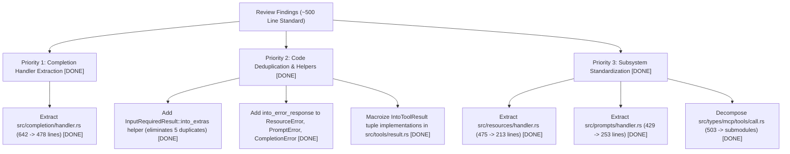

# Code Quality Review: Modularization, Duplication, and Idiomatic Rust

**Project**: `mcp-routing`  
**Date**: August 2026  
**Status**: Review Complete — Actionable Opportunities Identified  

---

## Executive Summary

Following the completion and archival of the initial modularization roadmap, a comprehensive second-phase architectural and code quality audit was performed across the `mcp-routing` codebase (`src/`, `tests/`, and `examples/`).

The audit evaluated three primary criteria:
1. **Modularization & File Size Limits**: Conformance to the updated project guideline of keeping files under ~500 lines by decomposing complex subsystems into submodules (`.agents/rules/mcp_development_guidelines.md`).
2. **Code Duplication**: Identification of redundant conversion logic (e.g. `InputRequiredResult` extras unpacking across 5 subsystems), repetitive error response mapping across registries, and macroizable trait boilerplate.
3. **Idiomatic Rust & Coding Standards**: Evaluation of Rust 2024 edition idioms, Serde conventions (`camelCase`, tagged enums), minimal trait derives, error conversion ergonomics, and test documentation compliance.

### Overall Assessment
The codebase demonstrates excellent health: zero Clippy warnings across all targets (`cargo clippy --all-targets --all-features`), 100% test pass rate, and full compliance with test documentation standards (`//!` and `///`) and copyright headers. With the guideline adjusted to ~500 lines to accommodate cohesive Rust types with inline unit tests, the modularization focus is narrowed to genuinely oversized files and high-value deduplication.

---

## 1. Modularization & File Size Limits (~500 Line Target) [COMPLETED]

Per `.agents/rules/mcp_development_guidelines.md` (Section 2), complex subsystems should be decomposed into submodules to maintain file sizes under ~500 lines. The following files were refactored:

| Subsystem / File | Original Lines | Action Taken | Resulting Structure | Status |
|---|---|---|---|---|
| [`src/completion/mod.rs`](file:///C:/Users/andre/Projects/mcp-routing/src/completion/mod.rs) | 642 lines | Extracted handler traits, adapters, and conversion macros to [`src/completion/handler.rs`](file:///C:/Users/andre/Projects/mcp-routing/src/completion/handler.rs). | `mod.rs` (120 lines), `handler.rs` (478 lines) | **Completed** |
| [`src/types/mcp/tools/call.rs`](file:///C:/Users/andre/Projects/mcp-routing/src/types/mcp/tools/call/mod.rs) | 503 lines | Decomposed into submodule directory [`src/types/mcp/tools/call/`](file:///C:/Users/andre/Projects/mcp-routing/src/types/mcp/tools/call/). | `mod.rs` (15 lines), `request.rs` (68 lines), `response.rs` (286 lines), `tests.rs` (128 lines) | **Completed** |
| [`src/resources/mod.rs`](file:///C:/Users/andre/Projects/mcp-routing/src/resources/mod.rs) | 475 lines | Extracted handler traits, adapters, and conversion macros to [`src/resources/handler.rs`](file:///C:/Users/andre/Projects/mcp-routing/src/resources/handler.rs). | `mod.rs` (235 lines), `handler.rs` (213 lines) | **Completed** |
| [`src/prompts/mod.rs`](file:///C:/Users/andre/Projects/mcp-routing/src/prompts/mod.rs) | 429 lines | Extracted handler traits, adapters, and conversion macros to [`src/prompts/handler.rs`](file:///C:/Users/andre/Projects/mcp-routing/src/prompts/handler.rs). | `mod.rs` (144 lines), `handler.rs` (253 lines) | **Completed** |

---

## 2. Code Duplication & Boilerplate

### 2.1 MRTR `InputRequiredResult` Extras Unpacking Quintuplication [COMPLETED]
- **Location**:
  - [`src/tools/mod.rs:72-85`](file:///C:/Users/andre/Projects/mcp-routing/src/tools/mod.rs#L72-L85) (`IntoToolResult for InputRequiredResult`)
  - [`src/prompts/mod.rs:88-99`](file:///C:/Users/andre/Projects/mcp-routing/src/prompts/mod.rs#L88-L99) (`IntoPromptResult for InputRequiredResult`)
  - [`src/resources/mod.rs:173-189`](file:///C:/Users/andre/Projects/mcp-routing/src/resources/mod.rs#L173-L189) (`IntoResourceResult for InputRequiredResult`)
  - [`src/completion/mod.rs:85-96`](file:///C:/Users/andre/Projects/mcp-routing/src/completion/mod.rs#L85-L96) (`IntoCompletionResult for InputRequiredResult`)
  - [`src/server/provider.rs:74-90`](file:///C:/Users/andre/Projects/mcp-routing/src/server/provider.rs#L74-L90) (`IntoServerDiscoveryResult for InputRequiredResult`)
- **Issue**: Each subsystem duplicates identical dictionary population logic for MRTR `requestState` and `inputRequests`:
  ```rust
  let mut extras = self.extras;
  if let Some(state) = self.request_state {
      extras.insert("requestState".to_string(), serde_json::Value::String(state));
  }
  if !self.input_requests.is_empty() && let Ok(reqs) = serde_json::to_value(&self.input_requests) {
      extras.insert("inputRequests".to_string(), reqs);
  }
  ```
- **Remedy**: Expose `pub fn into_extras(self) -> HashMap<String, Value>` and `pub fn into_parts(self) -> (Option<ResultMetaObject>, String, HashMap<String, Value>)` on `InputRequiredResult` in [`src/types/mcp/core/mrtr/request.rs`](file:///C:/Users/andre/Projects/mcp-routing/src/types/mcp/core/mrtr/request.rs).
- **Status**: **Completed** — Added `into_parts` and `into_extras` methods to [`InputRequiredResult`](file:///C:/Users/andre/Projects/mcp-routing/src/types/mcp/core/mrtr/request.rs#L214-L232), refactored all 5 subsystem conversions and [`CallToolResult::input_required`](file:///C:/Users/andre/Projects/mcp-routing/src/types/mcp/tools/call/response.rs#L133-L157), and added unit test coverage in [`src/types/mcp/core/mrtr/tests.rs`](file:///C:/Users/andre/Projects/mcp-routing/src/types/mcp/core/mrtr/tests.rs#L136-L172).

### 2.2 Repetitive Subsystem Error Mapping in Dispatchers [COMPLETED]
- **Location**:
  - [`src/resources/registry/dispatch.rs:86-104, 192-210, 322-340`](file:///C:/Users/andre/Projects/mcp-routing/src/resources/registry/dispatch.rs)
  - [`src/prompts/registry/dispatch.rs:43-55, 127-140`](file:///C:/Users/andre/Projects/mcp-routing/src/prompts/registry/dispatch.rs)
  - [`src/completion/registry.rs:239-251`](file:///C:/Users/andre/Projects/mcp-routing/src/completion/registry.rs#L239-L251)
- **Issue**: Handlers for `ResourceError`, `PromptError`, and `CompletionError` repeatedly match against `InvalidParams`, `NotFound`, and `Internal` to build `JsonRpcErrorResponse::invalid_params` or `JsonRpcErrorResponse::internal_error`.
- **Remedy**: Implement a helper method `into_error_response(self, id: Option<JsonRpcRequestId>) -> JsonRpcErrorResponse` on `ResourceError`, `PromptError`, and `CompletionError` (as well as `ToolError`, `DiscoveryError`, and `SubscriptionError` for comprehensive subsystem consistency).
- **Status**: **Completed** — Added `into_error_response` helper method to [`ResourceError`](file:///C:/Users/andre/Projects/mcp-routing/src/resources/mod.rs#L50-L60), [`PromptError`](file:///C:/Users/andre/Projects/mcp-routing/src/prompts/mod.rs#L39-L49), [`CompletionError`](file:///C:/Users/andre/Projects/mcp-routing/src/completion/mod.rs#L40-L50), [`ToolError`](file:///C:/Users/andre/Projects/mcp-routing/src/tools/mod.rs#L39-L49), [`DiscoveryError`](file:///C:/Users/andre/Projects/mcp-routing/src/server/provider.rs#L31-L41), and [`SubscriptionError`](file:///C:/Users/andre/Projects/mcp-routing/src/subscriptions/handler.rs#L38-L48). Refactored all dispatcher error handlers to single-line forwarding and added complete unit test suites.

### 2.3 Combinatorial `IntoToolResult` Tuple Implementations [COMPLETED]
- **Location**: [`src/tools/mod.rs:138-300`](file:///C:/Users/andre/Projects/mcp-routing/src/tools/mod.rs#L138-L300)
- **Issue**: Over 160 lines of repetitive trait implementations for `(Value, String)`, `(String, Value)`, `(Json<T>, String)`, `(String, Json<T>)`, `(Value, ContentBlock)`, `(ContentBlock, Value)`, `(Json<T>, ContentBlock)`, `(Json<T>, Vec<ContentBlock>)`, etc.
- **Remedy**: Introduce a declarative macro `impl_into_tool_result_tuple!` (similar to `impl_registered_collection!` in `src/extract/registered.rs`) inside [`src/tools/result.rs`](file:///C:/Users/andre/Projects/mcp-routing/src/tools/result.rs).
- **Status**: **Completed** — Extracted `IntoToolResult` and all implementations into dedicated submodule [`src/tools/result.rs`](file:///C:/Users/andre/Projects/mcp-routing/src/tools/result.rs), replaced over 160 lines of repetitive tuple conversions with declarative macro `impl_into_tool_result_tuple!`, re-exported `IntoToolResult` from [`src/tools/mod.rs`](file:///C:/Users/andre/Projects/mcp-routing/src/tools/mod.rs), and added full unit test coverage.

---

## 3. Idiomatic Rust & Code Quality

### 3.1 Extractor Trait & Handler Macro Consistency [COMPLETED]
- Across `src/completion/`, `src/prompts/`, `src/resources/`, `src/tools/`, `src/subscriptions/`, and `src/server/`, the handler conversion macros (`impl_into_completion_handler!`, `impl_into_prompt_handler!`, `impl_into_resource_handler!`, `impl_into_tool_handler!`, `impl_into_subscription_handler!`, `impl_into_discovery_handler!`) follow consistent 1-to-5 extractor arity patterns.
- Placing each handler conversion family in a dedicated `handler.rs` submodule (`src/server/handler.rs`, `src/tools/handler.rs`, `src/subscriptions/handler.rs`, `src/completion/handler.rs`, `src/prompts/handler.rs`, `src/resources/handler.rs`) establishes uniform subsystem architecture across the entire crate.
- **Status**: **Completed** — Extracted dynamic server discovery handler traits and macros into [`src/server/handler.rs`](file:///C:/Users/andre/Projects/mcp-routing/src/server/handler.rs), maintained backward-compatible aliases in [`src/server/provider.rs`](file:///C:/Users/andre/Projects/mcp-routing/src/server/provider.rs), standardized all handler conversion macros across subsystems to 1-to-5 extractors, and added comprehensive unit test suites with extractor validation in [`src/tools/handler.rs`](file:///C:/Users/andre/Projects/mcp-routing/src/tools/handler.rs) and [`src/server/handler.rs`](file:///C:/Users/andre/Projects/mcp-routing/src/server/handler.rs).

### 3.2 Error Construct Ergonomics [COMPLETED]
- `JsonRpcError` and `JsonRpcErrorResponse` provide both typed and Value-based constructors (`unsupported_protocol_version`, `unsupported_protocol_version_typed`, etc.).
- Moving the serialization logic to helper methods on the typed data structs (`UnsupportedProtocolVersionData::into_json_rpc_error`) reduces match complexity and makes error creation cleaner.
- **Status**: **Completed** — Added `new`, `into_json_rpc_error`, `into_typed_json_rpc_error`, `into_error_response`, and `into_typed_error_response` methods to [`UnsupportedProtocolVersionData`](file:///C:/Users/andre/Projects/mcp-routing/src/types/mcp/core/error.rs#L51-L101) and [`MissingRequiredClientCapabilityData`](file:///C:/Users/andre/Projects/mcp-routing/src/types/mcp/core/error.rs#L110-L159), simplified error response constructors in [`src/types/mcp/core/error.rs`](file:///C:/Users/andre/Projects/mcp-routing/src/types/mcp/core/error.rs), and added full unit test coverage.

---

## 4. Prioritized Action Plan



---

## Conclusion

With the guideline updated to ~500 lines, the codebase is in strong compliance with minimal remaining structural debt. Executing the high-priority extraction of `src/completion/handler.rs` and the deduplication helpers will bring 100% of files cleanly under the 500-line threshold while eliminating repetitive boilerplate.
